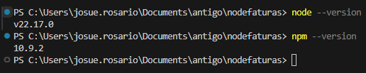
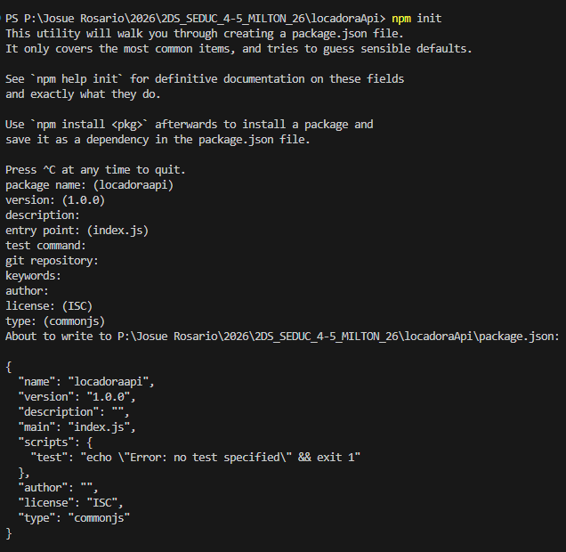
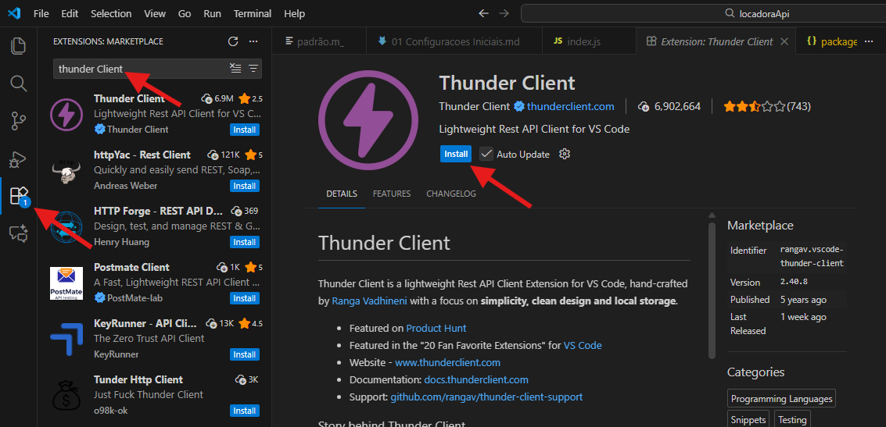
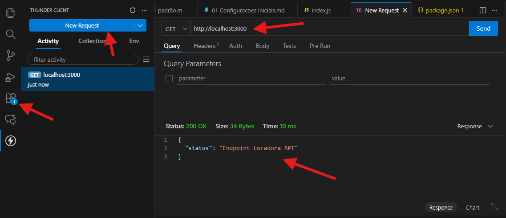
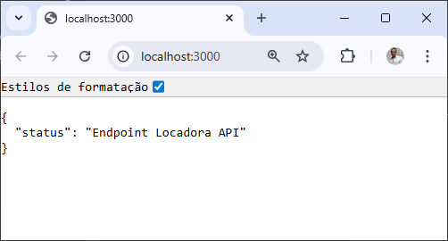

**versao do laboratório:** 1.0.0

**Data Criaçao:** 16/04/2026

# Descrição do Laboratório

Neste laboratório vamos aprender o que é node, configurar um servidor básico com rotas e instalar o nodemon

# Pré-Requisitos

Compreender conceitos de

- Cliente servidor
- como trabalhar com dependências

# Objetivos do Laboratório

Compreender :

- O que são API
- Como as APIs diferem das aplicações monolíticas
- Tipo de retorno de APIs
- JSON

# Links para estudo e consulta

**_Pagina oficial_**

https://nodejs.org/pt

**_Introdução ao Node (da pagina Oficial)_**

https://nodejs.org/pt/learn/getting-started/introduction-to-nodejs

**_Introdução ao Node Package Manager_**

https://nodejs.org/en/learn/getting-started/an-introduction-to-the-npm-package-manager

**_Morgan_**
https://www.npmjs.com/package/morgan

## 1. Analisando os pré-requisitos

Para que este projeto possa funcionar corretamente o node deve estar instalado. Verifique so o node e o gerenciador de pacotes do node (npm) estão corretamente instalados rodando estes comandos :

`node --version`

`npm --version`



## 2. Iniciando o projeto

O projeto precisa ser iniciado usando o npm. O comando abaixo cria um arquivo chamado package.json com todas as configurações necessárias para iniciar o projeto

`npm init`



Este comando pode ser rodado com a clausula -y que cria o arquivo sem precisar responder as perguntas:

`npm init -y`

obs: Pode ocorre erro de permissão ao tentar rodar os comandos. Neste caso será necessário permitir a execução de scripts. Para maiores informações leia a documentação de erros conhecidos.

`Set-ExecutionPolicy -ExecutionPolicy Unrestricted -Scope CurrentUser`

## 3. Instalando e configurando dependências nodemon

Para ajudar a desenvolver aplição instale as seguintes dependencias

| Nome    | Comando                   | Descrição                                              |
| ------- | ------------------------- | ------------------------------------------------------ |
| Nodemon | `npm i nodemon`           | Reinicia o servidor quando houver alterações           |
| Morgan  | `npm i morgan --save-dev` | Ajuda a debugar a aplicação                            |
| Express | `npm i express`           | framework que auxilia na construção de aplicaçãoes web |

Adicione o script `dev` ao package.json para rodar a aplicação usando nodemon

```json
  "scripts": {
    "test": "echo \"Error: no test specified\" && exit 1",
    "dev": "nodemon index.js"
  }
```

## 4. Configurando a Extensão para testes

Instalar a extesão thunder client para fazer testes na API



## 5. Criando o entry Point da aplicação

Crie a base da API

./index.js

```javascript
const express = require("express");
const PORT = 3000;
const app = express();
const morgan = require("morgan");

// configurações iniciais
app.use(express.json());
morgan.token("body", (req) => {
  return JSON.stringify(req.body);
});
app.use(morgan(":method :url :status :response-time ms :body"));

app.get("/", (req, res) => {
  res.json({ status: "Endpoint Locadora API" });
});

app.listen(PORT, () => {
  console.log("Locadora API");
  console.log(`Endereco: http://localhost:${PORT}`);
});
```

| comando    | Descrição                     |
| ---------- | ----------------------------- |
| res.json() | Responde requisições com JSON |

## 6. Testando a aplicação via thunder client

Para testar a aplicação via thunder client:

1. Crie um novo request
2. Adicione o endereço da aplicação
3. Verifique se o protocolo sendo utilizado é o GET
4. Clique em send e verifique o resultado



Neste ponto também é possível testar a aplicação via navegador usando o endereço.


